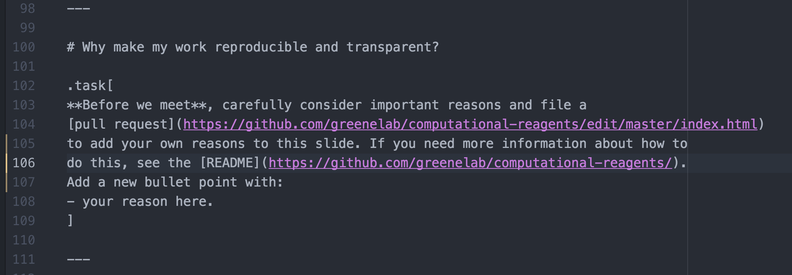

# Reagent validation in computational biology

## Introduction to this repository

I was asked to put together a one hour guided discussion of reproducibility and
transparency in the computational sciences for Penn
[GCB](http://www.med.upenn.edu/gcb/index.shtml) students. The [resulting
presentation](https://greenelab.github.io/computational-reagents/) uses
[remark](https://remarkjs.com) and is visible wherever the web is available.
The work is licensed CC-BY. Feel free to contribute any improvements via
[GitHub issues](https://github.com/greenelab/computational-reagents/issues).

## How to modify

This document is HTML with Markdown inside it. If you want to make changes - for
example maybe you want to add a new reason to a list - find the appropriate
slide markdown inside `index.html` and edit it. If you've never made a pull
request before, [GitHub has some documentation on the process](https://help.github.com/articles/creating-a-pull-request/).

Here's a screenshot of where you might want to edit:

